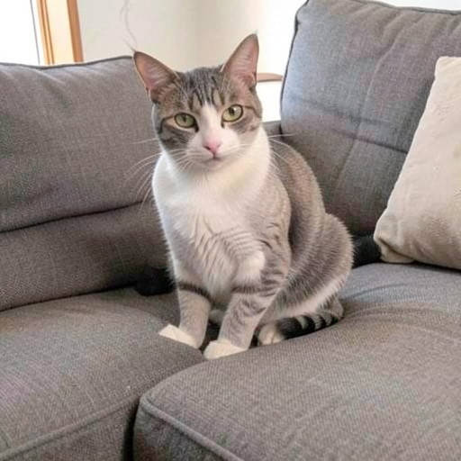
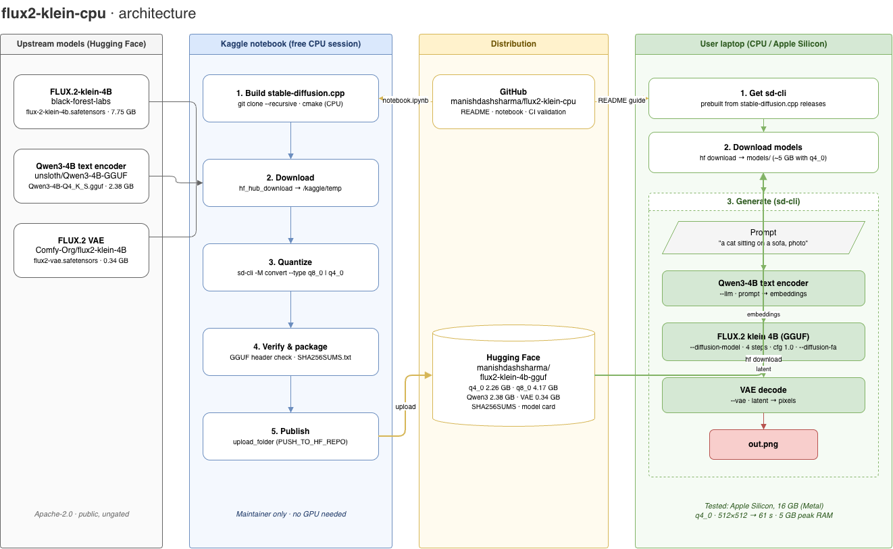

# FLUX.2 klein 4B on CPU


Run the [FLUX.2 \[klein\] 4B](https://huggingface.co/black-forest-labs/FLUX.2-klein-4B) image model on an ordinary laptop. No dedicated GPU, no 24 GB checkpoint, no ComfyUI setup.

Everything is already quantized and hosted on Hugging Face: **[manishdashsharma/flux2-klein-4b-gguf](https://huggingface.co/manishdashsharma/flux2-klein-4b-gguf)**. Download, run, done.

<p align="center">
  
  <br>
  <sub><code>"a cat sitting on a sofa, photo"</code>, q4_0, 512x512, 4 steps</sub>
</p>

| File | Size | Purpose |
|------|------|---------|
| `flux-2-klein-4b-q4_0.gguf` | 2.26 GB | Diffusion model, smallest and fastest |
| `flux-2-klein-4b-q8_0.gguf` | 4.17 GB | Diffusion model, closest to original quality |
| `Qwen3-4B-Q4_K_S.gguf` | 2.38 GB | Text encoder |
| `flux2-vae.safetensors` | 0.34 GB | VAE |

You need one diffusion model plus the text encoder and the VAE. With `q4_0` that is about 5 GB, so it fits in 16 GB of RAM with room to spare.

## How it works



The original model is quantized once on a free Kaggle CPU session and published to Hugging Face. Users only download the small files and run them with `sd-cli`: the Qwen3-4B text encoder turns the prompt into embeddings, FLUX.2 klein denoises the latent in 4 steps, and the VAE decodes it into an image.

## Tested

| Machine | Quant | Resolution | Time | Peak RAM |
|---------|-------|------------|------|----------|
| Apple Silicon Mac, 16 GB (Metal) | q4_0 | 512x512, 4 steps | 61 s | 5.0 GB |

Pure CPU machines (Intel/AMD laptops) will be slower. Results from other hardware are welcome, open an issue or PR.

## Quick start (macOS Apple Silicon, Linux x86_64)

```sh
git clone https://github.com/manishdashsharma/flux2-klein-cpu.git
cd flux2-klein-cpu
./generate.sh "a red fox reading a book under a tree, watercolour"
```

The first run downloads `sd-cli` and about 5 GB of models into `bin/` and `models/`, verifies every file against `SHA256SUMS.txt`, then saves the image to `outputs/`. Later runs start generating immediately.

```sh
./generate.sh "a lighthouse at dusk, oil painting" -q q8_0 -W 768 -H 512 -s 42
./generate.sh --help
```

| Option | Default | Meaning |
|--------|---------|---------|
| `-q`, `--quant` | `q4_0` | `q4_0` (smaller, faster) or `q8_0` (better quality) |
| `-W`, `-H` | `512` | Image size, multiples of 16 |
| `-s`, `--seed` | random | Fixed seed for reproducible images |
| `--steps` | `4` | Sampling steps |
| `-o`, `--output` | `outputs/<timestamp>.png` | Output file |

On Windows or other platforms, follow the manual setup below.

## Manual setup

### 1. Download the models

```sh
pip install -U huggingface_hub
hf download manishdashsharma/flux2-klein-4b-gguf \
  flux-2-klein-4b-q4_0.gguf Qwen3-4B-Q4_K_S.gguf flux2-vae.safetensors --local-dir models
```

Or download the files manually from the [Hugging Face repo](https://huggingface.co/manishdashsharma/flux2-klein-4b-gguf/tree/main). Verify them against `SHA256SUMS.txt`.

### 2. Get sd-cli

Download the build for your OS from stable-diffusion.cpp release [`master-945-a1ded76`](https://github.com/leejet/stable-diffusion.cpp/releases/tag/master-945-a1ded76). This is the version the models were quantized and tested with; newer [releases](https://github.com/leejet/stable-diffusion.cpp/releases) usually work too. On macOS, run `xattr -dr com.apple.quarantine .` in the extracted folder if Gatekeeper blocks it.

### 3. Run

```sh
./sd-cli \
  --diffusion-model models/flux-2-klein-4b-q4_0.gguf \
  --llm models/Qwen3-4B-Q4_K_S.gguf \
  --vae models/flux2-vae.safetensors \
  -p "a cat sitting on a sofa, photo" \
  --cfg-scale 1.0 --steps 4 --diffusion-fa \
  -W 512 -H 512 -o out.png
```

Tips:

- klein 4B is distilled, so use `--cfg-scale 1.0` and about 4 steps.
- Start at 512x512. CPU time grows quickly with resolution.
- Add `--offload-to-cpu` if you run out of memory.
- Use `-t <threads>` to match your physical core count.

## Troubleshooting

| Problem | Fix |
|---------|-----|
| Unknown flag error | Flags change between versions. Run `sd-cli --help` and adjust the command. |
| Out of memory while generating | Use `q4_0`, lower the resolution, add `--offload-to-cpu`. |
| Output looks noisy or wrong | Check that you used the klein VAE (`flux2-vae.safetensors`) and `--cfg-scale 1.0`. |
| `generate.sh` says checksum mismatch | Delete the file in `models/` and run again; the download was interrupted or corrupted. |
| macOS says the app is damaged or blocked | Run `xattr -dr com.apple.quarantine .` in the `sd-cli` folder. |

## For maintainers: rebuild the bundle

Only needed to publish new files, for example after a model update or a fine-tune. Users do not need this. The published files were built with stable-diffusion.cpp `master-945-a1ded76`.

1. Import [`notebook/notebook.ipynb`](notebook/notebook.ipynb) into Kaggle (Create -> Import Notebook).
2. Session options -> **Internet: On**. A CPU session is enough.
3. Optional: add a Kaggle Secret `HF_TOKEN`. Set it with write access if you use `PUSH_TO_HF_REPO`.
4. Run all cells. The notebook builds stable-diffusion.cpp, downloads the model (7.75 GB), VAE and Qwen3-4B, quantizes to `QUANT_TYPES`, writes `SHA256SUMS.txt` and zips everything.
5. Set `PUSH_TO_HF_REPO` to upload straight to Hugging Face, or download `klein4b_bundle.zip` from the Output tab.

| Variable | Default | Meaning |
|----------|---------|---------|
| `QUANT_TYPES` | `["q8_0", "q4_0"]` | Any of `f16`, `q8_0`, `q5_0`, `q5_1`, `q4_0`, `q4_1` |
| `LLM_FILE` | `Qwen3-4B-Q4_K_S.gguf` | Text encoder file from the Qwen3 GGUF repo |
| `RUN_TEST` | `False` | Generate one 512x512 image on Kaggle's CPU (slow) |
| `PUSH_TO_HF_REPO` | `None` | `"user/repo"` to upload the bundle to Hugging Face |

If the convert step rejects a flag, run `sd-cli --help`; flags change between versions.

## Project layout

```
generate.sh                  One-command download and generate
notebook/notebook.ipynb      Kaggle notebook that builds the quantized bundle
huggingface/README.md        Model card for the Hugging Face repo
docs/                        Architecture diagram and sample images
scripts/validate_notebook.py Checks the notebook (used by CI)
.github/                     Issue templates, PR template, CI
CONTRIBUTING.md              How to contribute
CHANGELOG.md                 Release notes
```

## Contributing

Issues and pull requests are welcome. Read [CONTRIBUTING.md](CONTRIBUTING.md) first. Please report security problems as described in [SECURITY.md](SECURITY.md).

## Status

The notebook has been run end to end on Kaggle and the resulting `q4_0` model tested on an Apple Silicon Mac. If something breaks on a newer stable-diffusion.cpp version, please open an issue.

## Credits and licenses

- [FLUX.2 \[klein\]](https://huggingface.co/black-forest-labs/FLUX.2-klein-4B) by Black Forest Labs (Apache-2.0)
- [stable-diffusion.cpp](https://github.com/leejet/stable-diffusion.cpp) by leejet (MIT)
- [Qwen3-4B](https://huggingface.co/Qwen/Qwen3-4B) by Alibaba Qwen team, GGUF by [Unsloth](https://huggingface.co/unsloth/Qwen3-4B-GGUF) (Apache-2.0)

The notebook and docs in this repo are released under the [MIT License](LICENSE). Quantized weights remain under the license of the original model.
